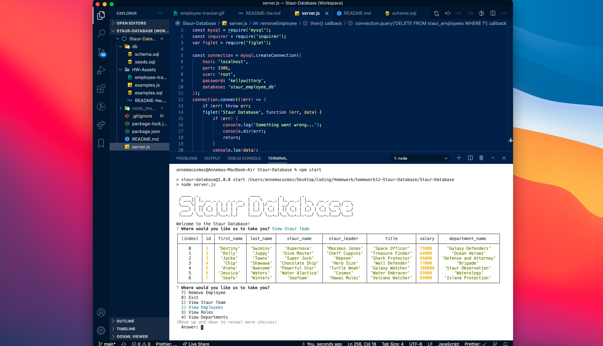
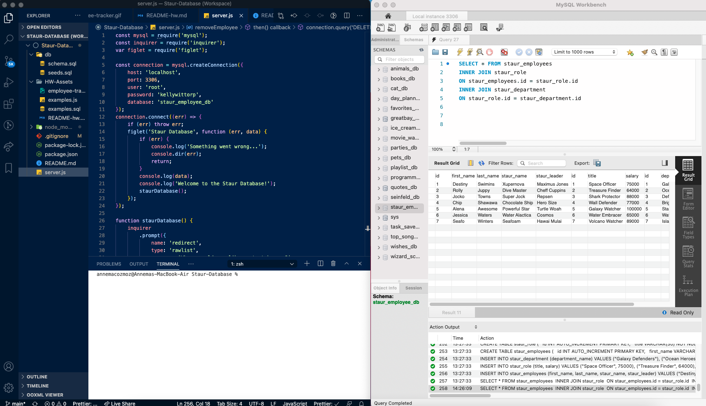

# Staur-Database

Staur Database is the best employee database in the galaxy! Display information about your Staur Team, Employees, you name it. Thanks for stopping in!

## Project Details

Welcome to Staur Database!

The Staur Database was created to be able to log, manage, and maintain a working roster of your Staur Team, Employees, etc. It is an amazingly simple and efficient way to track who is doing what at your company or super team. This app allows you to view a table of all the current employees, departments, roles, managers, and more! Using node, you can also add new employees, update existing departments, and delete current staur leaders. We hope you enjoy making your own personal database and changing the world for good.

Thanks for stopping in! I look forward to working together to make the present and future a better place.

## Application

Staur Database: https://youtu.be/E9-dw1bfymo

## Build Details

This application was developed using: Node.js, MySql, Inquirer, Figlet, JavaScript, and more!

## Repository & Preview

View the repository at: https://github.com/MichaelWitt/Staur-Database

Preview: 
Database: 

## Updates

You can find project updates in the repository, highlighting what was done to create the final product.

https://github.com/MichaelWitt/Staur-Database/commits/

## Credits

UNC Coding Bootcamp And Trilogy for the inspiration!

Thanks!

## Thanks For Visiting!

Come back soon :)
